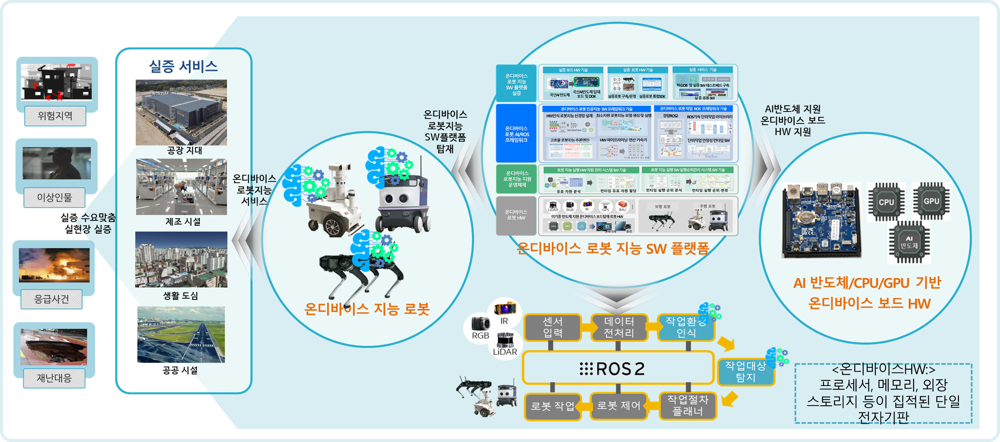
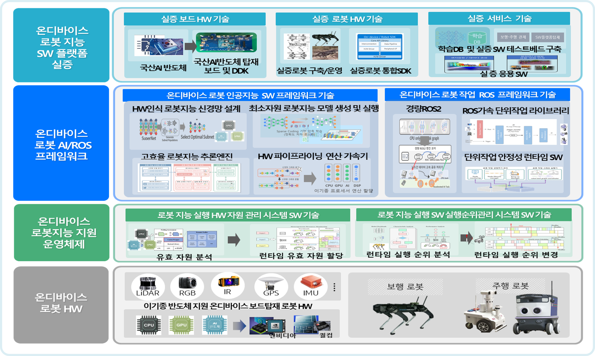
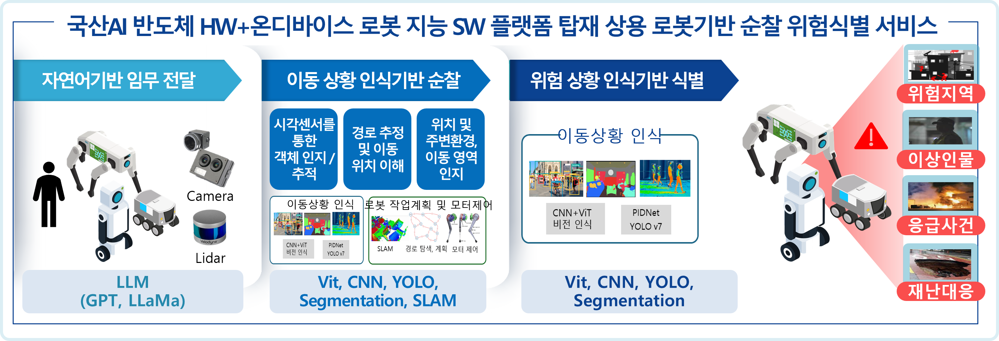

---

# Introduction to ORIS 

ORIS (On-device Robot Intelligence SW Platform) is an R&D project focused on developing a software platform technology that enables real-time robot intelligence processing using only the internal resources of on-device hardware, eliminating dependency on external environments such as cloud connections.

   
  <em>Figure 1. Overview of ORIS</em>

ORIS aims to develop core software platform technologies for on-device robot intelligence that overcome hardware resource constraints and enable real-time intelligent processing, validating them through implementations on commercial robotic platforms.

The key objective is to enable robots to perform intelligent tasks using only on-device hardware resources, without relying on external hardware infrastructure such as cloud computing or edge servers.

---

# ORIS Architecture

   
  <em>Figure 2. ORIS Architecture</em>

ORIS ensures practical robot implementation effectiveness by developing on-device AI and ROS framework integration, system-wide optimization support, and an operating system for resource and execution priority management. The overall architecture is divided into four key components:

1. **On-device Robot Hardware (HW)**
   - Physical robot platforms with embedded computing resources
   
2. **On-device Robot Intelligence Operating System**
   - Resource management and execution priority control
   - System-wide optimization support
   
3. **On-device Robot AI/ROS Framework**
   - Integration of AI capabilities with the ROS ecosystem
   - Unified framework for intelligent robotics development
   
4. **On-device Robot Intelligence SW Platform Demonstration**
   - Proof-of-concept implementations on commercial robotic systems
   - Validation of practical effectiveness in real-world scenarios

---

# ORIS Field Application 

   
  <em>Figure 3. Field Demonstrations in Industrial Settings</em>

ORIS provides core technologies that enable commercial robots to operate in unstructured real-world environments, addressing the latest demands of the AI industry. These technologies are validated through field demonstrations conducted directly in actual industrial settings, moving beyond laboratory experiments.

### ORIS in Action: 4 Key Safety Scenarios

   
  <em>Figure 4. ORIS_AI in Action: 4 Key Safety Scenarios</em>

> *Robot intelligence neural network inference results across four industrial safety demonstration scenarios: hazard event detection (fire/smoke), hazard situation detection (PPE compliance), hazard personnel detection (pathway deviation), and hazard factor detection (facility safety risks)*

---